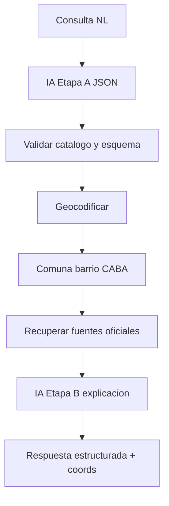

# Plan de implementación API TECBA (por etapas)

Documento operativo del backend. Fuentes: [arquitectura-ia.md](arquitectura-ia.md), [../PLAN.md](../PLAN.md), reporte TECBA.

Alcance de este repo: **backend Python + FastAPI** para el caso piloto CABA (`start_commercial_activity`). Frontend y mapa quedan fuera; acá se entrega el contrato JSON que el frontend consumirá (`POST /api/v1/consultations` y endpoints de soporte).

Principio rector: la IA interpreta y explica; **no es fuente de verdad**. Requisitos, oficinas y coordenadas salen de catálogos/DB y reglas del backend.



---

## Decisiones técnicas fijadas

| Tema | Decisión |
|---|---|
| Stack | FastAPI + Pydantic v2 + SQLAlchemy 2 + Alembic |
| DB | PostgreSQL + PostGIS (Docker Compose local) |
| IA | Cliente OpenAI-compatible vía `LLM_BASE_URL`, `LLM_API_KEY`, `LLM_MODEL` (Gemini/OpenRouter en free tier) |
| Geocoder | USIG/GCBA (compatible CABA); mock local si el servicio no responde en etapa temprana |
| Fuentes MVP | 3 fuentes **seed** en DB (trámites, territorial, oficinas) — stubs reales primero, reemplazables por ingesta real después |
| Catálogo MVP | Rubros oficiales epok (`rubro_{id}`, p.ej. `rubro_102` gastronomía) |
| Testing API | Colección Postman versionada en el repo, actualizada en **cada** etapa |
| Auth | Sin auth en MVP local; CORS abierto a localhost |

---

## Estructura de carpetas (Stage 0)

```text
api/
  app/
    main.py
    core/          # settings, logging, errors
    api/v1/        # routers
    schemas/       # contratos Pydantic (request/response)
    models/        # SQLAlchemy
    services/      # interpretacion, geocoding, retrieval, explanation
    providers/     # llm_client, geocoder_client
    db/            # session, base, seed
  alembic/
  postman/         # InobaLab-TECBA.postman_collection.json + environments
  docker-compose.yml
  pyproject.toml / requirements.txt
  .env.example
  README.md
```

Contratos iniciales viven en `app/schemas/` espejando las secciones 5, 7, 9–11 de [arquitectura-ia.md](arquitectura-ia.md).

---

## Etapa 0 — Scaffold y entorno (día 1–2)

**Objetivo:** API arranca y responde health.

- Proyecto FastAPI, settings con pydantic-settings, CORS, logging.
- Docker Compose: `postgres` (imagen PostGIS) + servicio `api` opcional.
- Endpoint: `GET /health` → `{ "status": "ok" }`.
- `.env.example` con `DATABASE_URL`, `LLM_*`, `GEOCODER_*`.
- **Postman:** colección base + environment `local` (`baseUrl=http://localhost:8000`), request Health.

**Criterio de prueba:** Postman Health → 200.

---

## Etapa 1 — Catálogo, modelos y seeds (sin IA)

**Objetivo:** datos mínimos consultables para el caso piloto.

- Modelos: `ActivityCategory`, `Source`, `Requirement`, `Office`, `MapLayer` (mínimo viable).
- Alembic + seed: 3 actividades, 3 fuentes, 2–3 requisitos y 1–2 oficinas por categoría (coords CABA fijas).
- Endpoints de lectura:
  - `GET /api/v1/activities`
  - `GET /api/v1/sources`
  - `GET /api/v1/offices?category=&commune=` (filtro simple)
- **Postman:** folder `Catalog` con esos 3 requests.

**Criterio de prueba:** listar actividades y oficinas con `source_ids` presentes.

---

## Etapa 2 — Geocodificación y jurisdicción

**Objetivo:** dirección → coords → comuna/barrio (o ambigüedad).

- `GeocoderClient` (USIG) + `MockGeocoder` (fixture `Av. Corrientes 2500` → Almagro / Comuna 5).
- Servicio: normalizar, validar precisión, detectar múltiples matches / fuera de CABA.
- Endpoint: `POST /api/v1/locations/geocode`

```json
{ "address": "Av. Corrientes 2500" }
```

Respuesta alineada a §7.2 (status `confirmed` | `ambiguous` | `out_of_scope` | `not_found`).

- Opcional temprano: capa PostGIS o tabla estática comunas/barrios para reverse lookup por punto.
- **Postman:** folder `Location` — casos feliz, ambiguo, fuera CABA, vacío.

**Criterio de prueba:** Corrientes 2500 → lat/lon + barrio; dirección fuera CABA → error tipado.

---

## Etapa 3 — Consulta determinística (camino feliz sin IA)

**Objetivo:** probar el contrato frontend **antes** de conectar el LLM.

- `POST /api/v1/consultations` con body simplificado (sin NL):

```json
{
  "activity_code": "rubro_102",
  "address": "Av. Corrientes 2500",
  "confirmed_location": null
}
```

- Pipeline: validar catálogo → geocode → filtrar requisitos/oficinas/fuentes por actividad + comuna → armar respuesta §11 (`summary` estático/template, `data_status`).
- Estados HTTP/body tipados: actividad fuera de alcance, ubicación ambigua (devolver candidatos, no inventar).
- **Postman:** folder `Consultations` — happy path + negativos (actividad inválida, dirección ambigua).

**Criterio de prueba:** respuesta completa con `requirements`, `physical_offices`, `sources`, coordenadas; cada bloque con `source_ids`.

---

## Etapa 4 — IA Etapa A (interpretación)

**Objetivo:** texto libre → JSON validado.

- `LLMClient` OpenAI-compatible; prompt + JSON Schema estricto (§5.2).
- Validación Pydantic + match al catálogo; si no match → `status` de aclaración / fuera de alcance (sin inventar trámites).
- Endpoint: `POST /api/v1/interpretations`

```json
{ "query": "Quiero abrir un local de ropa en Av. Corrientes 2500...", "conversation_id": null }
```

- Fallback: si LLM cae → `503` tipado (`llm_unavailable`), sin inventar interpretación.
- Unir al flujo: `POST /api/v1/consultations` acepta también `{ "query": "..." }` y corre interpretación → geocode → retrieval.
- **Postman:** folder `Interpretations` + actualizar `Consultations` con body NL; variables `LLM_*` solo en environment (no en colección pública).

**Criterio de prueba:** query del caso emblemático → `rubro_102` (gastronomía) + dirección; query “cafetería en Palermo” → aclaración o geocode de barrio; actividad desconocida → fuera de alcance.

---

## Etapa 5 — IA Etapa B (explicación) + oficinas/territorio

**Objetivo:** explicación ciudadana **solo** con contexto recuperado.

- Servicio `explain`: el LLM recibe únicamente registros recuperados; output validado; backend rechaza claims sin `source_ids`.
- Completar campos: `summary`, `steps`, `documents`, `territorial_information`, `online_procedures`, `map_layers`, `data_status` (partial/outdated/not_available).
- Confirmación de ubicación: `confirmed_location` en el body cuando hubo ambigüedad (§5.3 / UX paso 3).
- **Postman:** casos de info parcial (apagar una fuente en seed) y confirmación de match geocoding.

**Criterio de prueba:** sin fuentes → no hay requisitos inventados; con fuentes → summary cita bloques existentes.

---

## Etapa 6 — Seguimiento, trazabilidad y endurecimiento

**Objetivo:** acercarse a criterios de aceptación del MVP backend.

- `POST /api/v1/consultations/{id}/follow-ups` — preguntas dentro del mismo caso (contexto = resultado ya recuperado).
- Persistencia mínima de `Consultation` (query original, interpretación, fuentes usadas, modelo/prompt version).
- Rate limit básico / timeouts LLM; sanitizar URLs de fuentes.
- Tests automatizados pytest (happy path + negativos de §17) además de Postman.
- **Postman:** folder `Follow-ups` + colección exportada actualizada; README con orden de ejecución de la colección.

**Criterio de prueba:** e2e Postman del camino feliz NL → orientación con fuentes; follow-up no sale del contexto.

---

## Colección Postman (convención continua)

Archivo: [`postman/InobaLab-TECBA.postman_collection.json`](postman/InobaLab-TECBA.postman_collection.json)

| Folder | Se agrega en |
|---|---|
| `00 Health` | Etapa 0 |
| `01 Catalog` | Etapa 1 |
| `02 Location` | Etapa 2 |
| `03 Consultations (deterministic)` | Etapa 3 |
| `04 Interpretations + NL Consultations` | Etapa 4 |
| `05 Partial / Confirmation` | Etapa 5 |
| `06 Follow-ups` | Etapa 6 |

Environments: `local`, `staging` (cuando exista deploy). Cada PR que agregue un endpoint **debe** actualizar la colección en el mismo cambio.

---

## Orden de entrega sugerido (para ir probando ya)

1. Etapa 0–1 → estructura + seeds + Postman Health/Catalog
2. Etapa 2–3 → geocode + consultation determinística (demo sin depender de LLM)
3. Etapa 4–5 → NL completo con IA A/B
4. Etapa 6 → follow-ups, trazabilidad, tests

Esto alinea Backend de Sprints 0–3 de [../PLAN.md](../PLAN.md) (camino feliz sin IA primero, luego IA), sin bloquearse por frontend ni por ingesta real de IDECABA/BA Data: los seeds permiten probar endpoints de inmediato y luego reemplazar seeds por loaders reales.

---

## Seguimiento del agente

El estado de ejecución del agente vive en [`.cursor/agent/PLAN-EJECUCION.md`](../.cursor/agent/PLAN-EJECUCION.md). Actualizar ese archivo al avanzar cada etapa.
